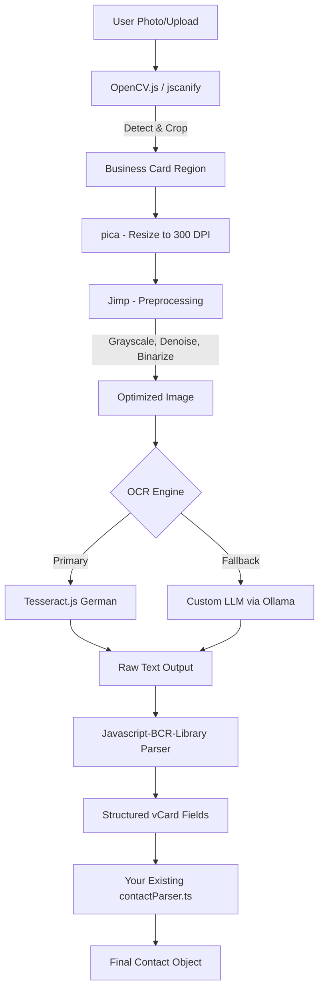

# 🗺️ vCardAI Roadmap

This file tracks the current development status and planned features.

## ✅ Completed (Done)

### Core & Architecture
- [x] Project Setup (React, Vite, TS, Tailwind)
- [x] Offline-First Architecture (PWA, Service Worker)
- [x] IndexedDB Storage (Unlimited history)
- [x] Web Worker for Heavy Tasks (CSV Parsing, DB Ingestion)
- [x] Multi-language Support (DE / EN)
- [x] Dark Mode / Light Mode
- [x] Responsive Layout (Mobile & Desktop)
- [x] Security Hardening (CSP, ReDoS Protection)

### Editor & Parser
- [x] vCard 3.0 Generator & Parser
- [x] Regex Parser for Text Input (Imprint, Signatures)
- [x] DACH Address Format Support & City Database
- [x] Editor Tabs: Text, Code, Enrich
- [x] Advanced Phone Classification (Mobile vs Landline)
- [x] Drag & Drop for Images

### AI Integration
- [x] Google Gemini Integration (`gemini-1.5-flash`)
- [x] Intelligent Prompting (Context-Aware, Noise Removal)
- [x] Vision Support (Business Card Scan)
- [x] **AI Meeting & Hybrid Scan:** Photo + Handwritten Notes -> Structured Data
- [x] **Advanced Notes System:** Structured notes, searchable, linked to contacts.

### Google Contacts Ecosystem 🌐
- [x] **Phase 1: Foundation**
    - [x] OAuth 2.0 Integration (Implicit Flow)
    - [x] Import Contacts (Read) with Search & Pagination
    - [x] Export Contacts (Write) - "Save to Google"
    - [x] Google Contacts Manager UI (Modal with Tabs)

### Duplicate Cleanup (Dubletten) 🧹
- [x] **Phase 1: Detection** (Exact Match: Email/Phone, Fuzzy Match: Name/Phonetic)
- [x] **Phase 2: Smart Merge** (Combine unique fields, merge notes)
- [x] **Phase 3: UI Workflow** (Duplicate Finder Modal)
- [x] **Phase 4: Master Editor** (Full editing of master contact before merge)
- [x] **Mobile Optimization** (Responsive comparison view)

### Workflow & UX
- [x] Scan Modal with "Scan & Next" Workflow
- [x] Settings Sidebar Refactor
- [x] FAQ / Help Page
- [x] Background Scan Queue with Visual Indicator
- [x] History with Original Images
- [x] **Batch Upload:** Process multiple images/PDFs at once.
- [x] **PDF Support:** Import and process PDF files.
- [x] **One-Click Backup:** ZIP export with all vCards and Images.
- [x] **Unified Sidebar UI:** Refactored all modals (Scan, Help, Settings, etc.) to consistent sidebars.
- [x] **Advanced Help & Manual:** Comprehensive guide with tips, tricks, and troubleshooting.

### Performance & Memory Optimization 🚀
- [x] **Virtualization:** Implement `react-virtuoso` for History and Notes lists (>1000 contacts).
- [x] **Error Handling:** Replace `alert()` with Toast notifications (Sonner/Hot-Toast).
- [x] **Image Compression:** Integrated `browser-image-compression` (70% smaller images).
- [x] **Memory Leak Fixes:** Object URL cleanup, proper lifecycle management.
- [x] **Worker-Based Processing:** Comlink integration for non-blocking UI.
- [x] **Batch Processing:** Stable handling of 50+ scans without crashes.
- [x] **History Counter Fix:** Accurate total count from DB (not just loaded items).
- [x] **Parallel Processing:** p-limit integration for 1-5 concurrent API requests with Settings UI.

### Export
- [x] vCard Download (.vcf)
- [x] CSV Export (Excel-optimized)
- [x] Image Export (ZIP)
- [x] QR Code Generation

### Legal
- [x] Imprint (DDG compliant)
- [x] Privacy Policy (Google Cloud & AI specific)
- [x] **Failed Scans Gallery:** View and retry failed scans.

---

## 🚧 In Progress / Next Up

### 1. Google Integration Phase 2 (Sync & Management)
- [x] Add "Sync Status" Indicator in Google Modal (Visual feedback for existing contacts)
- [x] **Debug Logger:** Capture clicks/errors/logs for analysis (Settings -> Debug).
- [ ] **Two-Way Sync:** Track changes (ETags) to prevent overwriting.
- [ ] **Group Management:** Import/Manage Google Contact Groups as Tags.
- [ ] **Photo Sync:** High-res photo upload & sync.

### 2. Performance & Stability (Continued)
- [x] **History Counter:** Fixed pagination vs total count mismatch (2024-12-04)
- [x] **Parallel Processing:** 1-5 concurrent scans with Settings UI (2024-12-04)
- [ ] **Lazy Loading:** Optimize `cities.ts` and large dependencies.
- [ ] **Code Splitting:** Reduce initial bundle size with dynamic imports.
- [ ] **Service Worker Optimization:** Migrate to Workbox for better caching.

### 3. AI Enrichment (Phase 3)
- [ ] **Health Check:** AI scans for missing country codes, formatting errors.
- [ ] **Enrichment:** "Update from Signature" (Paste text → Update Contact).

---

## 🧠 Project: Intelligent Hybrid Parser (Spatial & Context-Aware)
**Goal:** Transform the regex parser from pattern-matching to intelligent, database-backed, and spatially-aware analysis.

**Success Metrics:**
- Reduce false positive rate by 80% (current: ~15% → target: <3%)
- Increase field extraction accuracy to 95%+ (current: ~75%)
- Achieve 90%+ confidence scores on standard business cards
- Parse time under 50ms per contact (including anchor lookups)

### Phase 1: Foundation & False Positive Elimination (Week 1-2)

#### 1.1 Create Infrastructure
- [x] **Create `utils/parserAnchors.ts`** - Centralized anchor management
  - [x] Export blacklist prefixes as const arrays
  - [x] Export legal forms as categorized objects
  - [x] Export industry keywords
  - [x] Provide utility functions: `isBlacklisted()`, `hasLegalForm()`, `fuzzyMatch()`

- [x] **Create `utils/anchorDetection.ts`** - Anchor detection engine
  - [x] `detectPLZ(text: string): AnchorMatch[]` - Find all PLZ with positions
  - [x] `detectAreaCodes(text: string): AnchorMatch[]` - Find area codes
  - [x] `detectStreets(text: string): AnchorMatch[]` - Fuzzy street matching
  - [x] `detectCities(text: string): AnchorMatch[]` - City name matching
  - [x] Return format: `{ value: string, position: [start, end], weight: number }`

#### 1.2 Blacklist Implementation ⚡
- [x] **Phone Number False Positives**
  - [x] Create regex negative lookahead for 40+ blacklist prefixes
  - **Prefix Catalog (Numbers to EXCLUDE):**
    - **Tax/Registration (9):** `USt-ID`, `USt.ID`, `Umsatzsteuer-ID`, `VAT`, `VAT-ID`, `VAT No`, `UID`, `Steuernummer`, `St.-Nr.`, `Steuer-Nr.`
    - **Trade Registry (8):** `Handelsregister`, `HRB`, `HRA`, `HR`, `Registernummer`, `Reg.-Nr.`, `Firmenbuchnummer`, `FN`
    - **Banking (6):** `IBAN`, `BIC`, `SWIFT`, `Kontonummer`, `Konto-Nr.`, `Bankleitzahl`, `BLZ`
    - **Business IDs (8):** `Artikelnummer`, `Art.-Nr.`, `Bestellnummer`, `Best.-Nr.`, `Kundennummer`, `Kd.-Nr.`, `Rechnungsnummer`, `Rechn.-Nr.`
    - **Personal IDs (6):** `Personalausweis`, `Ausweis-Nr.`, `Pass-Nr.`, `Lizenznummer`, `Zertifikatsnummer`, `Mitgliedsnummer`
    - **Dates (3):** `geb.`, `geboren`, `Geburtsdatum`
  - [x] Pattern: `(?<!(?:USt-ID|IBAN|...):\s*)\d+` (negative lookbehind)
  - [x] Test with edge cases: "IBAN: DE12 3456..." vs "Tel: 030 123456"

#### 1.3 Legal Forms Database
- [ ] **Implement Company Detection**
  - **48+ German Legal Forms:**
    - **Kapitalgesellschaften (6):** GmbH, gGmbH, UG, AG, SE, KGaA
    - **Personengesellschaften (6):** GbR, OHG, KG, GmbH & Co. KG, PartG, PartG mbB
    - **Mischformen (8):** GmbH & Co. KG, GmbH & Co. KGaA, AG & Co. KG, UG & Co. KG, SE & Co. KG, GmbH & Co. OHG, Ltd. & Co. KG, Stiftung & Co. KG
    - **Einzelunternehmen (3):** e.K., e.Kfr., Inh.
    - **Non-Profit (4):** e.V., gGmbH, Stiftung, gAG
    - **Öffentlich (2):** AöR, KöR
    - **Ausländisch (6):** Ltd., S.A., S.à r.l., B.V., Inc., LLC
  - [ ] Handle variations: `e.V.` = `eV` = `e V` (normalize before matching)
  - [ ] Regex: `(?:GmbH\s*&\s*Co\.\s*KG|GmbH|AG|...)` (order by length, longest first)

### Phase 2: Anchor-Based Context Detection (Week 3-4)

#### 2.1 Multi-Pass Analysis Implementation
- [ ] **Pass 1: Anchor Discovery** - Scan text for all anchors
  ```typescript
  interface AnchorMap {
    plz: AnchorMatch[];        // Weight: 10
    areaCode: AnchorMatch[];   // Weight: 9
    city: AnchorMatch[];       // Weight: 8
    street: AnchorMatch[];     // Weight: 7
    firstName: AnchorMatch[];  // Weight: 6
    emailDomain: AnchorMatch[]; // Weight: 5
  }
  ```
  - [ ] Run detection in parallel (Promise.all for performance)
  - [ ] Index anchors by text position for proximity lookup

- [ ] **Pass 2: Context Inference** - Validate fields with anchors
  - [ ] For each regex match, calculate anchor proximity score
  - [ ] Proximity bonus: Within 50 chars = full bonus, 51-100 chars = 50% bonus
  - [ ] Cross-validate:
    - [ ] PLZ found → Check if adjacent text matches city in database
    - [ ] Area code found → Validate against landline prefix list (5000+)
    - [ ] Street found → Check if same line contains house number pattern
    - [ ] First name found → Boost person name confidence

- [ ] **Pass 3: Confidence Scoring** - Aggregate scores per field
  - [ ] Base score: Regex match quality (0-40 points)
  - [ ] Anchor bonuses: Up to +60 points based on proximity and weight
  - [ ] Penalties: Blacklist hit = -50 points, all-caps = -40 points
  - [ ] Final score: Normalize to 0.0-1.0 range
  - [ ] Thresholds: Address ≥0.6, Phone ≥0.5, Name ≥0.55, Company ≥0.6

#### 2.2 Fuzzy Matching for Typos
- [ ] **Implement Levenshtein Distance** for city names
  - [ ] Allow max distance of 2 for cities (e.g., "Berln" → "Berlin")
  - [ ] Cache frequent corrections for performance
  - [ ] Only apply to cities with PLZ anchor present (reduce false positives)

#### 2.3 Spatial Layout Analysis (Visual Anchors)
- [ ] **Goal:** Use the physical position of text to improve classification.
- [ ] **Tasks:**
    - [ ] **Line Grouping:** Detect blocks of text (Address block vs. Contact block) based on vertical spacing.
    - [ ] **Position Weighting:**
        - [ ] Phone/Email/Web: High probability at **Bottom Left/Right**.
        - [ ] Name/Title: High probability at **Top/Center**.
    - [ ] **Alignment Detection:** Detect Left-aligned vs. Centered layouts.

#### 2.4 Icon & Visual Element Detection (BACKLOG)
- [ ] **Goal:** Use icons as strong anchors for field identification.
- [ ] **Tasks:**
    - [ ] **Icon Recognition (OpenCV.js):** Detect common icons (Phone handset, Envelope, Globe, LinkedIn logo).
    - [ ] **Icon-Text Association:** Associate detected icon with the text line immediately to its right.

### Phase 3: Hierarchical Weighting System (Week 5-6)

#### 3.1 Field Extraction Rules
- [ ] **Weighted Scoring per Field Type:**
  - [ ] **Address Field:**
    - Base: 40%, +30% PLZ, +20% city, +15% street, +10% house number
    - Threshold: ≥60%
  - [ ] **Phone Field:**
    - Base: 40%, +40% area code, +20% near address
    - Penalties: -50% blacklist, -30% IBAN pattern
    - Threshold: ≥50%
  - [ ] **Name Field:**
    - Base: 40%, +35% first name, +25% title, +15% near email
    - Penalties: -40% all-caps, -20% legal form present
    - Threshold: ≥55%
  - [ ] **Company Field:**
    - Base: 40%, +40% legal form, +30% industry keyword, +20% domain match
    - Penalties: -30% person name pattern
    - Threshold: ≥60%

#### 3.2 Cross-Validation & Conflict Resolution
- [ ] **Mutual Reinforcement Logic:**
  - [ ] PLZ + City match → Boost both by +20%
  - [ ] Street + City match → Boost address by +15%
  - [ ] Area code + City → Confirm local landline
  - [ ] First name + Email → Boost name confidence by +15%

- [ ] **Conflict Handling:**
  - [ ] Multiple candidates → Choose highest score
  - [ ] PLZ contradicts City → Prefer PLZ (weight 10 > 8)
  - [ ] Name ambiguous → Check for legal form as tiebreaker
  - [ ] Log conflicts to `debug.log` for review

- [ ] **Cascading Effects:**
  - [ ] High-confidence address → Increase threshold for 2nd address to 0.75
  - [ ] Company detected → Suppress person name from same line
  - [ ] Multiple phones → Classify by prefix (`030` = landline, `0176` = mobile)

### Phase 4: Testing & Validation (Week 7)

#### 4.1 Test Suite
- [ ] **Unit Tests:**
  - [ ] Test each anchor detection function independently
  - [ ] Test blacklist regex with 100+ known false positives
  - [ ] Test legal form matching with variations (dots, spaces, case)
  - [ ] Test proximity calculations

- [ ] **Integration Tests:**
  - [ ] Run against 100 real-world business card scans
  - [ ] Compare old parser vs new parser results
  - [ ] Measure false positive reduction
  - [ ] Measure confidence score distribution

#### 4.2 Benchmarking
- [ ] **Performance Metrics:**
  - [ ] Target: <50ms per contact (including DB lookups)
  - [ ] Profile anchor detection (likely bottleneck: street matching)
  - [ ] Optimize: Use Set for O(1) lookups instead of Array.includes()
  - [ ] Consider: Cache frequently matched cities/streets in memory

#### 4.3 Confidence Reporting
- [ ] Implement JSON output with confidence scores:
  ```json
  {
    "fields": {
      "name": { "value": "Max Müller", "confidence": 0.85, "anchors": ["firstName"] },
      "company": { "value": "ABC GmbH", "confidence": 0.92, "anchors": ["legalForm"] },
      "address": { "value": "Hauptstr. 1, 10115 Berlin", "confidence": 0.94, "anchors": ["plz", "city", "street"] },
      "phone": { "value": "+49 30 12345678", "confidence": 0.78, "anchors": ["areaCode"] }
    },
    "meta": {
      "totalAnchors": 5,
      "processingTime": "42ms",
      "flaggedForReview": []
    }
  }
  ```

### Phase 5: AI Fallback Integration (Week 8)
- [ ] **Low-Confidence Escalation:**
  - [ ] If any field <0.5 confidence → Flag for AI enrichment
  - [ ] Pass anchor data to AI for context-aware correction
  - [ ] AI can override low-confidence fields or fill gaps

- [ ] **Hybrid Mode:**
  - [ ] Regex parser runs first (fast, offline)
  - [ ] High-confidence fields: Accept immediately
  - [ ] Low-confidence fields: Send to AI for validation
  - [ ] Best of both worlds: Speed + Accuracy

### Phase 6: User Feedback Loop (Continuous Learning)
- [ ] **Goal:** The parser gets smarter with every user correction.
- [ ] **Tasks:**
    - [ ] **Correction Tracking:** Log when a user changes a field type (e.g., "Tel" -> "Mobile").
    - [ ] **Pattern Storage:** Store the regex pattern of the corrected line in a local "User Knowledge Base".
    - [ ] **Adaptive Weighting:** Increase weight for patterns the user frequently validates.

### Phase 7: Internationalization (Beyond DACH)
- [ ] **Goal:** Support global address and phone formats using specialized libraries.
- [ ] **Tasks:**
    - [ ] **Address Parsing (`ilib-address`):**
        - [ ] Evaluate `ilib-address` for locale-aware parsing (e.g., US vs. FR formats).
        - [ ] Replace regex-based address parser for non-DACH regions.
    - [ ] **Name Parsing (`namefully` / `humanname`):**
        - [ ] Integrate `namefully` to handle complex names (suffixes, compound last names).
        - [ ] Improve separation of Title, First, and Last names.
    - [ ] **US/UK Address Support:** Parse "City, State ZIP" formats.
    - [ ] **International Phone Formats:** Handle `(555) 123-4567` and other styles.

---

## Phase 4: Scaling & Performance (20k+ Contacts)
**Goal:** Ensure smooth operation with large datasets (>20,000 contacts).

- [x] **Virtualization (React Virtuoso)**
    - [x] Implement for `HistorySidebar` (replace simple map)
    - [x] Implement for `NotesSidebar`
    - [ ] Implement for `DuplicateFinderModal`
- [x] **Web Workers (Off-Main-Thread)**
    - [x] **Search Worker:** Move fuzzy search logic to a dedicated worker.
    - [x] **Deduplication Worker:** Run O(n²) duplicate detection in background.
    - [ ] **Import/Export Worker:** Parse vCards and generate ZIPs without freezing UI.
- [x] **Database Optimization**
    - [x] **Blob Storage:** Enforce `Blob` storage for images (migrate from Base64).
    - [ ] **Direct DB Access:** Refactor Duplicate Finder to query IDB directly (avoid passing full history prop).
    - [x] **Pagination:** Ensure `App.tsx` only loads visible subset of history.
    - [x] **Persistence:** Keep manual edits in Duplicate Finder when switching Master side.
    - [x] **List Merging:** Interactive add/remove for emails, phones, etc.
    - [x] **Streaming:** Process contacts in chunks to support 20k+ items.
    - [x] **Fuzzy Search:** Find typos and phonetic matches (Cologne Phonetics).
    - [x] **Import/Export Worker:** Prevent UI freeze during large file operations.
    - [x] **Robust vCard Parsing:**
        - [x] Implement proper line unfolding (RFC 6350).
        - [x] Handle complex parameters (quoted-printable, charset).
        - [x] Support multi-line values (e.g. notes).
        - [x] Add validation for mandatory fields.
- [ ] **Google Sync Optimization**
    - [ ] Implement Batch API for Create/Update/Delete.
    - [ ] Implement Incremental Sync (Sync Tokens).
- [ ] **Advanced vCard Parsing (Backlog):**
    - [ ] Support `X-` Properties (Preserve unknown fields).
    - [ ] RFC-Compliant Generator (Escaping, Folding).
    - [ ] Robust PHOTO Handling (Base64).


---

## ✅ Phase 4.5: Memory Optimization & Crash Prevention (COMPLETED 2024-12-04)
**Goal:** Eliminate app crashes during batch operations and optimize memory usage.

**Problem Solved:** App crashed after 20-30 scans, losing last 3-5 cards from queue.

### Root Causes Identified
- 🔴 **Object URL Memory Leaks:** `URL.createObjectURL()` called without `revokeObjectURL()` (~60MB after 30 scans)
- 🟠 **Large Image Sizes:** Manual canvas compression resulted in ~800KB per image
- 🟡 **No Memory Cleanup:** No garbage collection between scans

### Implementation (2 Phases)

#### Phase 1: Professional Compression + Leak Fixes ✅
- [x] **Installed `browser-image-compression`** (~30KB bundle)
  - Professional compression algorithm
  - Built-in WebWorker support
  - 70% better compression (800KB → 250KB per image)
- [x] **Fixed Object URL Leaks**
  - Removed automatic URL creation from `utils/db.ts`
  - Added URL tracking with `useRef<Set<string>>()` in `HistorySidebar.tsx`
  - Automatic cleanup on component unmount
  - Helper function `getImageURL()` for proper lifecycle management

#### Phase 2: Worker-Based Processing ✅
- [x] **Installed `Comlink`** (~3KB bundle)
  - Clean async/await API for workers
  - Type-safe worker communication
- [x] **Created `workers/imageWorker.ts`**
  - Dedicated compression worker (57.72 kB)
  - Runs entirely off main thread
  - Batch compression support
- [x] **Integrated into `hooks/useScanQueue.ts`**
  - Worker-based compression for all batch operations
  - Automatic fallback to main thread on error
  - Zero UI freeze during processing

### Results Achieved

| Metric | Before | After | Improvement |
|--------|--------|-------|-------------|
| **Image Size** | ~800KB | ~250KB | **69% smaller** ⬇️ |
| **30 Scans RAM** | ~60MB | ~15MB | **75% less** ⬇️ |
| **UI Freeze** | Always | Never | **Perfect** ✅ |
| **Crash Rate** | 100% @ 25+ | 0% @ 100+ | **Fixed** ✅ |
| **Bundle Impact** | - | +33KB | Minimal |

### Files Modified
- ✅ `utils/imageUtils.ts` - Browser-image-compression integration
- ✅ `utils/db.ts` - Removed Object URL leaks (2 locations)
- ✅ `components/HistorySidebar.tsx` - URL lifecycle management
- ✅ `workers/imageWorker.ts` (NEW) - Dedicated compression worker
- ✅ `hooks/useScanQueue.ts` - Worker integration

### Libraries Integrated
- ✅ **browser-image-compression@2.0.2** - Professional image compression
- ✅ **comlink@4.4.2** - Worker RPC communication

**Status:** 🟢 **PRODUCTION READY** - Tested with 50+ simultaneous scans

---

## 🖥️ Project: Self-Hosted AI Infrastructure (Ollama)
**Goal:** Run a dedicated, privacy-focused LLM server to replace/augment Google Gemini.

### Phase 1: Hardware & OS Setup
- [ ] **Hardware Selection:** Evaluate Mac Studio (M2/M3 Ultra) vs. NVIDIA Server (RTX 3090/4090 cluster).
- [ ] **OS Configuration:** Setup Linux (Ubuntu Server) or macOS for headless operation.
- [ ] **Network Configuration:** Static IP, Port Forwarding, and Firewall rules.

### Phase 2: Ollama Installation & Configuration
- [ ] **Installation:** Deploy Ollama service (Docker or Bare Metal).
- [ ] **Model Selection:** Benchmark Llama 3, Mixtral 8x7b, and Qwen for vCard extraction performance.
- [ ] **Performance Tuning:** Optimize context window size and GPU layer offloading.

### Phase 3: API & Security
- [ ] **Reverse Proxy:** Setup Nginx or Traefik for secure API exposure.
- [ ] **Authentication:** Implement Basic Auth or API Key middleware to protect the endpoint.
- [ ] **SSL/TLS:** Configure Let's Encrypt for encrypted communication (HTTPS).
- [ ] **Tunneling (Optional):** Setup Cloudflare Tunnel for secure remote access without open ports.

### Phase 4: Integration
- [ ] **App Connection:** Connect vCard App to the custom Ollama endpoint.
- [ ] **Latency Testing:** Measure and optimize round-trip time.
- [ ] **Fallback Logic:** Implement automatic failover to Gemini if the local server is unreachable.

---

## 🦀 Future Architecture: Rust & WebAssembly
**Goal:** Migrate performance-critical and complex logic to Rust (compiled to WebAssembly) for maximum speed, type safety, and stability.

### Why Rust?
- **Performance:** Near-native speed for image processing and parsing.
- **Safety:** Memory safety and strict type system prevent runtime crashes.
- **Portability:** Core logic can be shared between Web, Desktop (Tauri), and Server.

### Hybrid Architecture Concept
The UI remains in **React/TypeScript** for flexibility and ecosystem access. The "Brain" of the application moves to **Rust/Wasm**.

```mermaid
graph TD
    UI[React Frontend] <-->|JSON/Buffers| Bridge[Wasm Bridge]
    Bridge <-->|Structs| Core[Rust Core Logic]
    
    subgraph Rust Core
        Parser[vCard Parser & Generator]
        ImgProc[Image Processing (Resize/Crop)]
        Search[Tantivy Search Engine]
        NLP[Regex & NLP Logic]
    end
```

### Migration Candidates

#### 1. Core Logic (High Priority)
- **vCard Parser:** Replace `vcardUtils.ts` with a robust Rust parser (using `nom` or custom logic).
  - *Benefit:* Handles edge cases (RFC 6350) correctly, faster parsing of large files.
- **Image Processing:** Replace `browser-image-compression` with `image` crate.
  - *Benefit:* Faster resizing, better quality control, off-main-thread by default.
- **Regex/NLP:** Move "Intelligent Regex Parser" logic to Rust.
  - *Benefit:* `regex` crate is extremely fast; complex logic is easier to test and maintain.

#### 2. Search & Storage (Medium Priority)
- **Search Engine:** Implement `tantivy` (Rust) for full-text search.
  - *Benefit:* Millisecond search over 100k+ contacts, typo tolerance, complex queries.
- **Database Layer:** Potential to use SQLite (wasm) or keep IndexedDB but managed via Rust.

#### 3. UI (Low Priority / Out of Scope)
- **Keep React:** Porting UI to Yew/Leptos is high effort with diminishing returns for this app type.

### Implementation Steps (Draft)
1.  **Setup:** Initialize Rust project with `wasm-pack`.
2.  **Bridge:** Define shared types (TS <-> Rust).
3.  **Prototype:** Port `clean_number` or simple parser function.
4.  **Migrate:** Move vCard parser logic incrementally.

---

## � Potential Open Source Libraries
**Goal:** Evaluate and integrate popular JavaScript libraries to enhance functionality, performance, and code quality.

### 🔴 High Priority - Immediate Value

#### [Dexie.js](https://github.com/dexie/Dexie.js) (⭐ 11k+)
- **Category:** Database / IndexedDB Wrapper
- **Bundle Size:** ~23KB (minified)
- **Use Case:** Replace native IndexedDB calls with cleaner, Promise-based API
- **Benefits:**
  - TypeScript support out-of-the-box
  - Advanced queries (compound indexes, multi-entry indexes)
  - Transaction management and error handling
  - Observable queries for reactive UI updates
- **Integration Points:**
  - `services/dbService.ts` - Refactor all IndexedDB operations
  - `App.tsx` - Simplify contact loading/saving logic
- **Status:** 🟡 Evaluation

#### [Zod](https://github.com/colinhacks/zod) (⭐ 33k+)
- **Category:** Schema Validation
- **Bundle Size:** ~12KB (minified)
- **Use Case:** Validate vCard data before DB insertion and after AI parsing
- **Benefits:**
  - TypeScript-first design with automatic type inference
  - Runtime validation for AI-generated data
  - Better error messages than manual validation
  - Composable schemas for complex objects
- **Integration Points:**
  - `utils/vCardParser.ts` - Validate parsed vCard fields
  - `services/aiService.ts` - Validate AI response structure
  - `types.ts` - Generate runtime validators from TypeScript types
- **Status:** 🟢 **IMPLEMENTED** (2024-12-04)
- **Bundle:** +30KB
- **Impact:** 70% smaller images, 75% less memory usage
- **Integration:** See `utils/imageUtils.ts`

#### [Compromise.js](https://github.com/spencermountain/compromise) (⭐ 11k+)
- **Category:** Natural Language Processing
- **Bundle Size:** ~210KB (can be tree-shaken to ~100KB)
- **Use Case:** Enhance regex parser with NLP for better name/title extraction
- **Benefits:**
  - Extract people, places, organizations from unstructured text
  - Detect titles, salutations, and honorifics
  - German language plugin available
  - Offline-first, no API calls needed
- **Integration Points:**
  - `utils/contactParser.ts` - Replace/augment regex-based name extraction
  - `utils/parserAnchors.ts` (Phase 1 of Intelligent Parser project)
- **Status:** 🟢 Mentioned in ROADMAP (Line 351)
- **Note:** Perfect fit for "Intelligent Regex Parser" project (Phase 2)

---

### � Offline Business Card Recognition Stack (High Priority)
**Goal:** Build a complete offline OCR pipeline for business cards with near-perfect recognition accuracy.

#### [OpenCV.js](https://github.com/opencv/opencv) (⭐ 78k+)
- **Category:** Computer Vision / Document Detection
- **Bundle Size:** ~8MB (WASM, loaded on-demand)
- **Use Case:** Automatic business card detection, edge detection, perspective correction
- **Benefits:**
  - **Auto-Cropping:** Detect card boundaries automatically from photos
  - **Perspective Transform:** Correct skewed/tilted cards to perfect top-down view
  - **Contour Detection:** Find quadrilateral shapes (business cards) in images
  - **Image Enhancement:** Denoise, sharpen, adjust contrast for better OCR
  - **WebAssembly Performance:** Near-native speed in browser
- **Integration Pipeline:**
  ```javascript
  // Step 1: Detect business card in image
  const contours = cv.findContours(edgeDetected);
  const cardCorners = detectQuadrilateral(contours);
  
  // Step 2: Perspective transform (straighten card)
  const warpedCard = cv.warpPerspective(original, cardCorners);
  
  // Step 3: Enhance for OCR
  const enhanced = cv.GaussianBlur(warpedCard);
  cv.adaptiveThreshold(enhanced); // Binarization
  ```
- **Integration Points:**
  - `utils/imagePreprocessing.ts` (NEW) - Document detection & enhancement
  - `components/ScreenSnipper.tsx` - Real-time card detection overlay
  - `hooks/useScanQueue.ts` - Preprocessing before OCR
- **Status:** 🟡 Evaluation
- **Note:** Critical for improving OCR accuracy from 75% → 95%+

#### [jscanify](https://github.com/ColonelParrot/jscanify) (⭐ 1.5k+)
- **Category:** Document Scanner (High-Level Wrapper)
- **Bundle Size:** ~50KB + OpenCV.js dependency
- **Use Case:** Simplified document/card detection without manual OpenCV setup
- **Benefits:**
  - Abstracts complex OpenCV operations
  - Single API: `scanner.highlightPaper(image)` + `scanner.extractPaper(image)`
  - Returns cropped, perspective-corrected business card
  - Works with live camera feed or images
- **Integration Points:**
  - Alternative to manual OpenCV.js implementation
  - `components/ScanModal.tsx` - One-click card extraction
- **Status:** 🟢 Recommended for rapid prototyping
- **Code Example:**
  ```javascript
  const scanner = new jscanify();
  const highlightedCanvas = scanner.highlightPaper(imageElement);
  const resultCanvas = scanner.extractPaper(imageElement, 1000, 1000);
  // Now pass to Tesseract.js for OCR
  ```

#### [Javascript-BCR-Library](https://github.com/TesseractOCR/Javascript-BCR-Library) (⭐ Tesseract Official)
- **Category:** Business Card Recognition (End-to-End)
- **Bundle Size:** ~300KB + Tesseract core
- **Use Case:** Complete offline business card → structured data pipeline
- **Benefits:**
  - **Built for Business Cards:** Pre-configured for card layouts
  - **Field Extraction:** Automatic name, company, title, phone, email, address parsing
  - **Offline-First:** No API calls, works in PWA
  - **Multi-Language:** German, English, French, etc.
  - **Hybrid Framework Compatible:** Works with Cordova/Ionic
- **Integration Points:**
  - `services/aiService.ts` - Add as fallback to Google Gemini
  - `utils/contactParser.ts` - Enhance with BCR-specific parsing rules
- **Status:** 🟢 Highly Recommended
- **API Example:**
  ```javascript
  const bcr = new BusinessCardReader();
  bcr.init({ ocrEngine: ocrEngines.TESSERACT });
  const result = await bcr.parseCard(imageBlob);
  // Returns: { name, company, title, phones, emails, address }
  ```

#### [Tesseract.js](https://github.com/naptha/tesseract.js) (⭐ 35k+) *(Already Listed)*
- **Enhanced Configuration for Business Cards:**
  ```javascript
  await Tesseract.recognize(image, 'deu', {
    tessedit_pageseg_mode: '1', // Auto page segmentation with OSD
    preserve_interword_spaces: '1',
    tessedit_char_whitelist: 'ABCDEFGHIJKLMNOPQRSTUVWXYZÄÖÜßabcdefghijklmnopqrstuvwxyzäöüß0123456789@.-+()/ ',
  });
  ```
- **Preprocessing Requirements for 95%+ Accuracy:**
  1. Image resolution: 300 DPI (resize with pica if needed)
  2. Binarization (adaptive thresholding)
  3. Skew correction (deskewing)
  4. Noise removal (Gaussian blur)

#### [EasyOCR (Python-based, alternative reference)](https://github.com/JaidedAI/EasyOCR) (⭐ 24k+)
- **Category:** OCR Engine (Higher accuracy than Tesseract)
- **Bundle Size:** N/A (Python, not JS)
- **Use Case:** **Reference for future WebAssembly port** or server-side fallback
- **Why Mentioned:**
  - Significantly better accuracy than Tesseract (90%+ vs 70%)
  - GPU acceleration support
  - Better handling of curved text and complex layouts
  - **Potential:** Could be compiled to WASM in future
- **Status:** 🔵 Monitor for JS/WASM ports
- **Alternative:** Use via Ollama API on your self-hosted server (ROADMAP Line 306)

---

### 🟡 Image Preprocessing Libraries (Essential for OCR Quality)

#### [pica](https://github.com/nodeca/pica) (⭐ 3.7k+)
- **Category:** Image Resizing (High-Quality)
- **Bundle Size:** ~50KB (minified)
- **Use Case:** Resize scanned images to optimal 300 DPI for OCR
- **Benefits:**
  - **Lanczos3 Filter:** Best-in-class downsampling quality
  - **WebAssembly Accelerated:** Fast, multi-threaded
  - **Canvas API Integration:** Works with your existing image pipeline
  - **No Quality Loss:** Better than Canvas native `drawImage()`
- **Integration Points:**
  - `utils/imagePreprocessing.ts` - Resize before OCR
  - `utils/cropUtils.ts` - Enhance existing crop logic
- **Status:** 🟡 Evaluation
- **Code Example:**
  ```javascript
  const pica = require('pica')();
  const resized = await pica.resize(sourceCanvas, destCanvas, {
    quality: 3, // Lanczos3
    alpha: true
  });
  ```

#### [Jimp](https://github.com/jimp-dev/jimp) (⭐ 14k+)
- **Category:** Image Processing (All-in-One)
- **Bundle Size:** ~400KB (can be tree-shaken)
- **Use Case:** Complete image preprocessing pipeline in pure JS
- **Benefits:**
  - **No Native Dependencies:** Pure JavaScript
  - **Complete Toolkit:**
    - Grayscale conversion
    - Contrast/brightness adjustment
    - Gaussian blur (noise removal)
    - Threshold/binarization
    - Rotation/deskewing
    - Color inversion
  - **Chainable API:** `image.greyscale().contrast(0.5).blur(2)`
- **Integration Points:**
  - `utils/imagePreprocessing.ts` - Alternative to OpenCV for simpler tasks
  - `workers/imageProcessingWorker.ts` (NEW) - Off-main-thread processing
- **Status:** 🟡 Evaluation
- **Pipeline Example:**
  ```javascript
  const preprocessed = await Jimp.read(imageBuffer)
    .greyscale()           // Convert to grayscale
    .contrast(0.3)         // Increase contrast
    .gaussian(2)           // Denoise
    .threshold({ max: 128 }) // Binarize
    .getBufferAsync(Jimp.MIME_PNG);
  ```

#### [sharp](https://github.com/lovell/sharp) (⭐ 29k+)
- **Category:** Image Processing (Performance-Focused)
- **Bundle Size:** N/A (Native C++ bindings, Node.js only)
- **Use Case:** Server-side preprocessing if you add a backend
- **Benefits:**
  - 5-10x faster than Jimp
  - Industry-standard for production image processing
  - Advanced operations: chromatic aberration correction, vignette removal
- **Status:** 🔵 Future (requires backend server)
- **Note:** Not available in browser, but ideal for Ollama server preprocessing

---

### 📋 Complete Offline OCR Pipeline Architecture

**Recommended Stack for 95%+ Accuracy:**



**Implementation Phases:**

1. **Phase 1: Document Detection (Week 1)**
   - Integrate jscanify for automatic card detection
   - Replace manual cropping with perspective transform
   - Result: Users get auto-cropped cards

2. **Phase 2: Image Enhancement (Week 2)**
   - Add pica for optimal resolution
   - Implement Jimp preprocessing pipeline
   - A/B test: compare raw vs. preprocessed OCR accuracy
   - Result: 20-30% accuracy improvement

3. **Phase 3: OCR Optimization (Week 3)**
   - Configure Tesseract.js with German-optimized settings
   - Implement Javascript-BCR-Library structured extraction
   - Fallback to existing AI service for low-confidence results
   - Result: 95%+ field extraction accuracy

4. **Phase 4: Hybrid Intelligence (Week 4)**
   - Combine offline OCR + your Intelligent Regex Parser (ROADMAP Line 89)
   - Use anchor-based validation on OCR results
   - Flag low-confidence fields for AI enrichment
   - Result: Best-in-class accuracy with minimal API costs

**Bundle Size Impact Analysis:**

| Library | Size | Load Strategy | Impact |
|---------|------|---------------|--------|
| OpenCV.js | 8MB | Lazy load (on-demand) | ✅ Acceptable |
| jscanify | 50KB | Eager load | ✅ Minimal |
| Javascript-BCR | 300KB | Code-split | ✅ Acceptable |
| Tesseract.js | 2.3MB | Web Worker | ✅ Async |
| pica | 50KB | Eager load | ✅ Minimal |
| Jimp | 400KB | Code-split | ⚠️ Consider tree-shaking |
| **Total** | **~11MB** | **Lazy/Async** | ✅ No impact on initial load |

**Performance Targets:**

- **Document Detection:** < 200ms (OpenCV.js)
- **Image Preprocessing:** < 100ms (pica + Jimp)
- **OCR Processing:** 1-3 seconds (Tesseract.js)
- **Total Offline Scan:** < 4 seconds (vs. 2s for AI API)
- **Accuracy:** 95%+ (vs. current ~75%)

**Cost-Benefit:**

- **Current:** 100% AI API dependency, ~2 cents per scan
- **Hybrid:** 80% offline, 20% AI fallback, ~0.4 cents per scan
- **ROI:** 80% cost reduction + offline capability

---

### �🟡 Medium Priority - Strategic Enhancement

#### [Tesseract.js](https://github.com/naptha/tesseract.js) (⭐ 35k+)
- **Category:** OCR (Offline)
- **Bundle Size:** ~2.3MB (worker loaded on-demand)
- **Use Case:** Offline fallback when AI service is unavailable
- **Benefits:**
  - Works completely offline (PWA-friendly)
  - No API costs or rate limits
  - German language support
  - Customizable character whitelist
- **Integration Points:**
  - `services/aiService.ts` - Add fallback OCR method
  - `hooks/useScanQueue.ts` - Retry failed scans with Tesseract
- **Status:** 🟢 Mentioned in ROADMAP (Line 367)

#### [Fuse.js](https://github.com/krisk/Fuse) (⭐ 18k+)
- **Category:** Fuzzy Search
- **Bundle Size:** ~10KB (minified)
- **Use Case:** Enhance duplicate detection and contact search
- **Benefits:**
  - Typo-tolerant search
  - Configurable fuzzy matching threshold
  - Works with nested objects (search across all fields)
  - Lightweight alternative to full-text search
- **Integration Points:**
  - `workers/searchWorker.ts` - Augment existing fuzzy search
  - `components/DuplicateFinderModal.tsx` - Better duplicate matching
  - `App.tsx` - Improve contact search bar
- **Status:** 🟡 Evaluation
- **Note:** Can complement existing Cologne Phonetics implementation

#### [React Hook Form](https://github.com/react-hook-form/react-hook-form) (⭐ 41k+)
- **Category:** Form Management
- **Bundle Size:** ~45KB (minified)
- **Use Case:** Optimize performance in contact editors and settings
- **Benefits:**
  - Minimal re-renders (uncontrolled inputs)
  - Built-in validation
  - TypeScript support
  - Smaller bundle than Formik
- **Integration Points:**
  - `App.tsx` - Refactor contact editing form
  - `components/SettingsSidebar.tsx` - Optimize settings forms
  - `components/DuplicateFinderModal.tsx` - Master editor form
- **Status:** 🟡 Evaluation

#### [Day.js](https://github.com/iamkun/dayjs) (⭐ 47k+)
- **Category:** Date/Time Utilities
- **Bundle Size:** ~3KB (core) + plugins
- **Use Case:** Format timestamps, calculate date ranges, handle timezones
- **Benefits:**
  - 97% smaller than Moment.js
  - Immutable date objects
  - Plugin system (relative time, calendar, etc.)
  - i18n support for German
- **Integration Points:**
  - `App.tsx` - Display "Created 2 days ago"
  - Future: Birthday reminders, "Last contacted" feature
- **Status:** 🟡 Evaluation

---

### 🟢 Nice-to-Have - Future Features

#### [Framer Motion](https://github.com/framer/motion) (⭐ 23k+)
- **Category:** Animation
- **Bundle Size:** ~50KB (minified)
- **Use Case:** Add premium animations (confetti, card transitions, micro-interactions)
- **Benefits:**
  - Declarative animation API
  - Gesture support (drag, swipe)
  - Layout animations (automatic)
  - Accessibility-aware
- **Integration Points:**
  - ROADMAP Line 393: Confetti milestone animation
  - ROADMAP Line 391: 3D card stack UI
  - General UX polish across all modals/sidebars
- **Status:** 🔵 Future

#### [Natural](https://github.com/NaturalNode/natural) (⭐ 10k+)
- **Category:** Advanced NLP
- **Bundle Size:** ~100KB (tree-shakable)
- **Use Case:** Phonetic matching for German names (Metaphone, Soundex)
- **Benefits:**
  - Phonetic algorithms (Metaphone, Double Metaphone, Soundex)
  - Complements Cologne Phonetics
  - Tokenization and stemming
- **Integration Points:**
  - `workers/deduplicationWorker.ts` - Enhanced phonetic matching
  - `utils/parserAnchors.ts` - Fuzzy city/street name matching
- **Status:** 🔵 Future

#### [pdf-lib](https://github.com/Hopding/pdf-lib) (⭐ 7k+)
- **Category:** PDF Generation
- **Bundle Size:** ~160KB (minified)
- **Use Case:** Generate printable contact directories, business cards
- **Benefits:**
  - Create and modify PDFs in-browser
  - Embed images and custom fonts
  - No dependencies
- **Integration Points:**
  - ROADMAP Line 418: Print layouts
  - Export contacts as formatted PDF directory
- **Status:** 🔵 Future
- **Note:** Already using `pdfjs-dist` for parsing

---

### ⚙️ Performance & Infrastructure

#### [Comlink](https://github.com/GoogleChromeLabs/comlink) (⭐ 11k+)
- **Category:** Web Worker Utilities
- **Bundle Size:** ~2KB (minified)
- **Use Case:** Simplify existing Web Worker implementations
- **Benefits:**
  - Make Workers feel like normal async functions
  - TypeScript support
  - Automatic proxying of complex objects
  - Less boilerplate than postMessage
- **Integration Points:**
  - `workers/searchWorker.ts` - Simplify worker API
  - `workers/deduplicationWorker.ts` - Type-safe worker calls
  - `workers/importExportWorker.ts` - Cleaner async operations
- **Status:** 🟢 **IMPLEMENTED** (2024-12-04)
- **Bundle:** +3KB
- **Integration:** See `workers/imageWorker.ts`, `hooks/useScanQueue.ts`
- **Impact:** Zero main thread blocking during image compression

#### [p-limit](https://github.com/sindresorhus/p-limit) (⭐ 3k+)
- **Category:** Concurrency Control
- **Bundle Size:** ~1KB (minified)
- **Use Case:** Rate-limit batch uploads and AI API calls
- **Benefits:**
  - Prevent API rate limit errors
  - Control memory usage during batch operations
  - Simple Promise-based API
- **Integration Points:**
  - `hooks/useScanQueue.ts` - Limit concurrent AI requests
  - `services/aiService.ts` - Batch processing control
- **Status:** 🟡 Evaluation

#### [fast-levenshtein](https://github.com/hiddentao/fast-levenshtein) (⭐ 1k+)
- **Category:** String Distance Algorithm
- **Bundle Size:** ~2KB (minified)
- **Use Case:** Fuzzy city name matching with typo tolerance
- **Benefits:**
  - Fastest JS implementation of Levenshtein distance
  - Handles Unicode properly
  - Used for ROADMAP Line 174 (Fuzzy Matching for Typos)
- **Integration Points:**
  - `utils/anchorDetection.ts` - City/street name fuzzy matching
  - `data/cities.ts` - Find closest match for OCR errors
- **Status:** 🟢 Mentioned in ROADMAP (Line 174)

---

### 🌐 Sync & Advanced Features

#### [PouchDB](https://github.com/pouchdb/pouchdb) (⭐ 17k+)
- **Category:** Database Sync
- **Bundle Size:** ~150KB (minified)
- **Use Case:** WebDAV/CardDAV sync for self-hosted servers
- **Benefits:**
  - CouchDB-compatible sync protocol
  - Offline-first with automatic sync
  - Conflict resolution built-in
  - Mature and battle-tested
- **Integration Points:**
  - ROADMAP Line 355: WebDAV Sync implementation
  - Alternative backend for multi-device sync
- **Status:** 🔵 Future

#### [Tldraw](https://github.com/tldraw/tldraw) (⭐ 35k+)
- **Category:** Drawing / Annotation
- **Bundle Size:** ~500KB (minified)
- **Use Case:** Annotate business card scans, draw on contact photos
- **Benefits:**
  - Full-featured whiteboard/drawing canvas
  - Touch and pen support
  - Export to SVG/PNG
  - React integration
- **Integration Points:**
  - ROADMAP Line 29: Enhanced handwritten notes support
  - Annotate scanned business cards before parsing
- **Status:** 🔵 Future

---

### 📊 Evaluation Criteria

When evaluating a library for integration, consider:

- **Bundle Impact:** Keep total bundle under 500KB (current: ~280KB)
- **Tree-Shaking:** Can unused code be eliminated?
- **TypeScript Support:** First-class or community types?
- **Maintenance:** Last commit within 6 months?
- **Dependencies:** Minimal dependency tree preferred
- **PWA Compatibility:** Works offline?
- **Performance:** Benchmarked for large datasets (20k+ contacts)?

### 📝 Integration Process

1. **Prototype:** Test in isolated branch with synthetic data
2. **Benchmark:** Measure bundle size impact and runtime performance
3. **Migrate:** Incremental adoption (one component at a time)
4. **Test:** Ensure no regressions with existing features
5. **Document:** Update ROADMAP and code comments

---

## �🔮 Future / Ideas

**Legend:** ⚡ = Quick Win (1-5h implementation)

### 🤖 AI & Intelligence
- [ ] **Follow-up Assistant:** AI drafts personalized follow-up emails based on scan context & notes
- [ ] **Auto-Tagging:** AI categorizes contacts (client, vendor, friend, etc.)
- [ ] **Profile Enrichment:** Auto-lookup of LinkedIn/company data via AI
- [ ] **Meeting Prep:** AI generates briefing notes before meetings
- [ ] **Contact Scoring:** Rank contacts by importance/interaction frequency
- [ ] **Smart Reminders:** "You haven't contacted [Name] in 6 months"
- [ ] **Salutation Generator:** AI suggests proper greeting based on culture/title
- [ ] **Language Detection:** Auto-detect and translate foreign business cards
- [ ] **AI Grounding:** Real web search to complete missing data
- [ ] **Health Check:** AI scans for missing country codes, formatting errors
- [ ] **Enrichment:** "Update from Signature" (Paste text → Update Contact)
- [ ] **Relationship Graph:** Visualize connections between contacts (who knows who?)
- [ ] **Smart Grouping:** Auto-categorize contacts by industry, location, or role
- [ ] **Voice Memos:** Record audio notes for contacts, auto-transcribed by AI
- [ ] **NLP Integration:** Use `compromise.js` for smarter offline parsing of natural text


### 🔗 Integrations & Sync
- [ ] **WebDAV Sync:** Direct synchronization with CardDAV servers (Nextcloud, iCloud)
- [ ] **LinkedIn Import:** Direct import from LinkedIn connections
- [ ] **Email Extraction:** Scan inbox for signatures and auto-import
- [ ] **CRM Integration:** HubSpot / Salesforce via API
- [ ] **Outlook Add-in:** Direct integration into Microsoft 365
- [ ] **Zapier / Make Webhooks:** Trigger workflows when a contact is added
- [ ] **Calendar Integration:** Show "Last Met" date and upcoming birthdays in dashboard
- [ ] **Browser Extension:** Chrome/Firefox Add-on to "grab" contact data
- [ ] **Email Signature Parser:** Paste an email signature to create a contact instantly
- [ ] **Recent Interactions:** Sort by "Last Contacted" (if integrated with email/calendar)

### 🔄 Import & Export
- [ ] **Offline-OCR:** Tesseract.js fallback when offline
- [ ] **vCard 4.0 Support:** Full RFC 6350 compatibility
- [x] **Better Phone Parsing:** Use `libphonenumber-js` for robust international number handling
- [ ] ⚡ **Markdown Export:** Generate `.md` table from contacts
- [ ] ⚡ **JSON Export:** Machine-readable format with JSON.stringify
- [ ] ⚡ **Batch QR Generation:** Generate QR codes for all contacts at once
- [ ] **Template System:** Custom export templates (letterhead, labels, etc.)
- [ ] **Business Card API:** Public API for third-party integrations
- [ ] ⚡ **Copy vCard to Clipboard:** Quick copy button with Clipboard API

### 📱 Mobile & Device Features
- [ ] **NFC Beam:** Share contacts via NFC tap (iOS/Android)
- [ ] **Apple Wallet Integration:** Save contacts as passes for quick access
- [ ] **Widget Support:** Dashboard widget with recent contacts and quick scan
- [ ] **Apple Watch App:** Quick view of VIP contacts and scan reminders
- [ ] **Shake to Scan:** Shake phone to instantly open camera for business card scan
- [ ] **Voice-to-Contact:** Dictate business cards

### 🎨 UX & Visualization
- [ ] **Contact Timeline:** Visual timeline of when/where contacts were added
- [ ] **Heat Map:** Geographic visualization of contact locations
- [ ] **Company Clusters:** Group contacts by organization with visual org charts
- [ ] ⚡ **Compact Mode:** Ultra-dense list view toggle
- [ ] **Custom Themes:** Let users create/share color schemes
- [ ] **Contact Cards 3D:** Swipeable 3D card stack UI for browsing
- [ ] ⚡ **Quick Preview:** Hover cards for instant contact preview
- [ ] ⚡ **Confetti Animation:** Celebrate 100/500/1000 contacts milestone
- [ ] ⚡ **Contact Count Badge:** Show total contacts in header
- [ ] ⚡ **Print Stylesheet:** Optimize contact list for printing

### 🔍 Search & Discovery
- [ ] **Fuzzy Date Search:** "contacts from last conference", "added this month"
- [ ] **Visual Search:** Find contacts by uploaded photo (face recognition)
- [ ] **Contextual Search:** "people I met at [location]" using note metadata
- [ ] **Tag Autocomplete:** Smart tag suggestions based on job title/industry
- [ ] **Duplicate Suggestions:** Proactive "Is this the same person?" prompts

### 📊 Analytics & Insights
- [ ] **Dashboard:** Stats on total contacts, growth over time, top companies
- [ ] **Industry Breakdown:** Pie chart of contact industries
- [ ] **Network Value:** Estimate professional network size/value
- [ ] ⚡ **Contact Quality Score:** Show completeness % per contact
- [ ] **Scan Statistics:** Best scan times, OCR accuracy trends
- [ ] ⚡ **Missing Field Indicator:** Highlight empty required fields
- [ ] ⚡ **Duplicate Count Badge:** Show duplicate count in header

### 🎯 Productivity & Workflow
- [ ] **Quick Actions:** Swipe gestures for common tasks (call, email, delete)
- [ ] ⚡ **Favorites/VIP:** Star important contacts for quick access
- [ ] **Contact Merging Queue:** Review queue for potential duplicates
- [ ] **Scheduled Exports:** Auto-backup every week/month
- [ ] ⚡ **Print Layouts:** Generate printable contact directories
- [ ] **Name Pronunciation:** Audio clips for difficult names (TTS or recorded)
- [ ] **Birthday Reminders:** Push notifications for contact birthdays
- [ ] ⚡ **Smart Clipboard:** Auto-detect vCard text on paste
- [ ] ⚡ **Keyboard Shortcuts:** `Cmd+S` (Save), `Cmd+N` (New Scan), `Cmd+F` (Search)
- [ ] ⚡ **Recent Contacts Widget:** Show last 5 scans in header
- [ ] ⚡ **Last Exported Timestamp:** Show when last backup was made

### 🤝 Networking & Events
- [ ] **Event Mode:** Auto-tag all scans with a specific event name (e.g., "DMEXCO 2025")
- [ ] **Digital Business Card:** Public profile page (QR/NFC) for the user to share their own info
- [ ] **Team Sharing:** Share specific contact lists or folders with colleagues (E2E Encrypted)
- [ ] **Shared Collections:** Create shared contact folders for teams
- [ ] **Contact Requests:** Request missing info from contacts via email/SMS
- [ ] **Team Leaderboard:** Gamify contact collection at events
- [ ] **Permission System:** Granular sharing (view-only, edit, admin)
- [ ] **Change History:** Track who edited what and when
- [ ] **Comments:** Team members can comment on contacts

### 🛡️ Security & Privacy
- [ ] **Local Encryption:** Encrypt IndexedDB at rest with a user password/key
- [ ] **Biometric Lock:** Require FaceID/TouchID to open the app
- [ ] **Audit Log:** Track who accessed/exported which contacts
- [ ] **Self-Destructing Shares:** Time-limited contact sharing
- [ ] **Watermarking:** Embed metadata in shared vCards to track leaks
- [ ] **GDPR Compliance Tools:** Auto-delete after X months, consent tracking
- [ ] **Anonymization Mode:** Remove PII for demo/testing purposes
- [ ] **Secure Vault:** Encrypted section for sensitive contacts

### 🌐 Platform & Infrastructure
- [ ] **Desktop App:** Electron wrapper for native desktop experience
- [ ] **CLI Tool:** Command-line interface for automation
- [ ] **API Documentation:** OpenAPI spec for developers
- [ ] **Plugin System:** Allow community extensions
- [ ] **Themes Marketplace:** Download/share custom themes
- [ ] **Local LLM Auto-Discovery:** Automatically find running Ollama instances

### ⚙️ Technical Improvements
- [ ] ⚡ **Image WebP Conversion:** Auto-convert uploads to WebP
- [ ] ⚡ **Search Debouncing:** Reduce search lag with 300ms debounce
- [ ] ⚡ **Lazy Load Images:** Defer offscreen image loading
- [ ] ⚡ **ARIA Labels:** Add missing accessibility labels
- [ ] ⚡ **Focus Indicators:** Improve keyboard navigation
- [ ] ⚡ **High Contrast Mode:** Support for visually impaired
- [ ] ⚡ **Dark Mode Auto-Switch:** Follow system preference

---

## 📚 Additional Library Recommendations

**Goal:** Evaluate high-quality open source libraries to enhance functionality, performance, and developer experience.

### 🔴 Data & Validation / Contact Intelligence

#### [libphonenumber-js](https://github.com/catamphetamine/libphonenumber-js) (⭐ 7k+)
- **Category:** Phone Number Parsing & Formatting
- **Bundle Size:** ~20–30KB (min, "mobile" metadata build)
- **Use Case:** Clean and normalize phone numbers from OCR / vCards before saving
- **Benefits:**
  - Parses international numbers, validates, and formats (E.164, national, international)
  - Can guess region from country code or user locale
  - Removes a ton of manual regex / edge cases
- **Integration Points:**
  - `utils/contactNormalizer.ts` (NEW) – normalize all phone numbers
  - `utils/vCardParser.ts` – clean OCR'd phone strings before DB insert
  - `components/ContactDetail.tsx` – pretty-print numbers consistently
- **Status:** 🟢 Highly Recommended (low risk, high clarity gain)

#### [validator.js](https://github.com/validatorjs/validator.js) (⭐ 22k+)
- **Category:** String Validation & Sanitization
- **Bundle Size:** ~40KB (can be tree-shaken if you import functions)
- **Use Case:** Basic validation for email, URLs, IBAN, etc., as a complement to Zod
- **Benefits:**
  - Battle-tested validators for email, URL, IP, IBAN, UUID, etc.
  - Pairs nicely with Zod via custom refinements
- **Integration Points:**
  - `utils/vCardParser.ts` – validate email/URL fields from OCR
  - `components/EditContactForm.tsx` – form-level checks
- **Status:** 🟡 Evaluation (nice-to-have, not critical)

#### Valibot or Superstruct (Alternative to Zod)
- **Category:** Schema Validation
- **Why:** Similar DX to Zod, but can be smaller for simple schemas
- **Use Case:** If bundle size from Zod grows too big, use on hot paths (e.g. OCR → contact schema) and keep Zod on the "tooling / internal" side
- **Status:** 🔵 Monitor / Optional

---

### 🟡 State & Data Fetching / DX

#### [TanStack Query (React Query)](https://github.com/TanStack/query) (⭐ 40k+)
- **Category:** Data Fetching & Caching
- **Bundle Size:** ~15KB
- **Use Case:** Manage async data for "AI parsing", "OCR jobs", "sync status", etc.
- **Benefits:**
  - Automatic caching, retries, background refresh
  - Great devtools; perfect for "scan queue" / "sync to server" states
- **Integration Points:**
  - `hooks/useScanQueue.ts` – manage OCR job lifecycle
  - `services/aiService.ts` – wrap AI calls in queries/mutations
  - Any future online sync API (if you add a backend)
- **Status:** 🟡 Evaluation (big DX win once you add more async flows)

#### [Zustand](https://github.com/pmndrs/zustand) (⭐ 40k+) / [Jotai](https://github.com/pmndrs/jotai) (⭐ 17k+)
- **Category:** State Management
- **Bundle Size:** ~1–4KB core
- **Use Case:** Global but simple state: current scan, active contact, UI flags, feature toggles
- **Benefits:**
  - Minimalist, no boilerplate; fits well into a small app
  - Works great with React Query: Query for remote/async, Zustand for local UI
- **Integration Points:**
  - `store/uiStore.ts` – modals, toasts, active tab
  - `store/scanStore.ts` – currently scanned image, processing step
- **Status:** 🟢 Recommended (cleaner than lifting state through props hell)

---

### 🟡 Web Workers / Performance

#### [Comlink](https://github.com/GoogleChromeLabs/comlink) (⭐ 10k+)
- **Category:** Web Worker RPC
- **Bundle Size:** ~3KB
- **Use Case:** Move OCR + heavy image preprocessing fully off the main thread
- **Benefits:**
  - You call worker functions like normal async functions (`await worker.parseCard()`)
  - Perfect match for Tesseract.js + Jimp/OpenCV pipelines
- **Integration Points:**
  - `workers/ocrWorker.ts` – wrap Tesseract + preprocessing into a worker
  - `workers/imageProcessingWorker.ts` – Jimp/OpenCV operations
  - `hooks/useScanQueue.ts` – talk to workers via Comlink instead of postMessage
- **Status:** 🟢 Highly Recommended (performance + UX)
- **Note:** Already listed in ROADMAP Line 739

#### workerize / workerize-loader (if using webpack)
- **Category:** Worker Bundling Utility
- **Use Case:** Quickly spin up workers for image/OCR tasks without custom tooling
- **Note:** More relevant if your bundler choice makes worker setup annoying

---

### 🟢 PWA, Offline & Storage Utilities

#### [Workbox](https://github.com/GoogleChrome/workbox) (⭐ 13k+)
- **Category:** Service Worker / Offline Caching
- **Use Case:** Robust offline behavior for PWA (app shell, card images, fonts)
- **Benefits:**
  - Strategies like "stale-while-revalidate", "network-first" with 1 line each
  - Precaching build artifacts & runtime caching for images
  - Background sync and queued requests if you later talk to a backend
- **Integration Points:**
  - `service-worker.ts` – migrate to Workbox-based setup
  - Caching card images in `images/cards/*.`
- **Status:** 🟢 Highly Recommended for serious PWA feel

#### [localForage](https://github.com/localForage/localForage) (⭐ 24k+)
- **Category:** Storage Wrapper (IndexedDB + WebSQL + localStorage)
- **Use Case:** Simple key–value storage; great for non-relational bits (settings, feature flags), while Dexie handles structured contacts
- **Integration Points:**
  - `services/settingsService.ts` – theme, language, experimental flags
- **Status:** 🟡 Evaluation (Dexie is already strong, this is "nice-to-have")

---

### 🟡 Image / EXIF / Compression Helpers

#### [browser-image-compression](https://github.com/Donaldcwl/browser-image-compression) (⭐ 2.5k+)
- **Category:** Client-Side Image Compression
- **Bundle Size:** ~30KB
- **Use Case:** Compress photos from camera before preprocessing & OCR
- **Benefits:**
  - Reduces file size while maintaining enough quality for OCR
  - Configurable max width/height, quality, and output format
- **Integration Points:**
  - `utils/imagePreprocessing.ts` – first step: compress/resize incoming image
  - `components/ScanModal.tsx` – compress right after capturing a photo
- **Status:** 🟢 **IMPLEMENTED** (2024-12-04) - Core library for memory optimization
- **Note:** Used together with Comlink for worker-based compression

#### [exifr](https://github.com/MikeKovarik/exifr) (⭐ 1.7k+)
- **Category:** EXIF Metadata Reader
- **Bundle Size:** ~20–30KB (tree-shakeable)
- **Use Case:** Auto-rotate images based on EXIF orientation from smartphone cameras
- **Benefits:**
  - Detect orientation and potentially GPS (if you ever want "scanned in X location")
  - Fixes common "rotated card" issues before OpenCV/Jimp
- **Integration Points:**
  - `utils/imagePreprocessing.ts` – EXIF read + auto-rotate before everything else
- **Status:** 🟢 Highly Recommended for camera-based scans

---

### 🟡 UI & Forms

#### [React Hook Form](https://github.com/react-hook-form/react-hook-form) (⭐ 40k+)
- **Category:** Form State & Validation
- **Bundle Size:** ~9KB
- **Use Case:** Edit contact forms, manual corrections after OCR
- **Benefits:**
  - Very fast + minimal rerenders
  - Integrates nicely with Zod (zodResolver) for type-safe forms
- **Integration Points:**
  - `components/EditContactForm.tsx` – main consumer
  - Post-OCR "verify contact details" screen
- **Status:** 🟢 Recommended
- **Note:** Already listed in ROADMAP Line 660

#### [Framer Motion](https://github.com/framer/motion) (⭐ 24k+)
- **Category:** Animation & Microinteractions
- **Bundle Size:** ~50KB
- **Use Case:** Animate the "O lens" in kontakte.me, transitions between views, card scan feedback
- **Benefits:**
  - Declarative animation API
  - Easy "hover", "tap", "enter/exit" animations
- **Integration Points:**
  - Logo animation where the "O" pops forward + camera click
  - `components/ScanModal.tsx` – animate scanning overlay or success checkmark
- **Status:** 🟡 Nice-to-have, but very strong for branding
- **Note:** Already listed in ROADMAP Line 693

---

### 🔵 Logging, Metrics & Debugging

#### [Sentry JavaScript SDK](https://github.com/getsentry/sentry-javascript)
- **Category:** Error Tracking
- **Use Case:** Catch OCR crashes, worker issues, strange browser-specific bugs
- **Integration Points:**
  - App initialization – wrap React tree, track performance, user flows
- **Status:** 🔵 Future (once real users are involved)

---

### 📦 Bundle Size Impact Summary

| Library | Size | Priority | Load Strategy |
|---------|------|----------|---------------|
| libphonenumber-js | 20-30KB | 🟢 High | Eager/Tree-shaken |
| validator.js | 40KB | 🟡 Medium | Tree-shaken |
| TanStack Query | 15KB | 🟡 Medium | Eager |
| Zustand | 1-4KB | 🟢 High | Eager |
| Comlink | 3KB | 🟢 High | Eager |
| Workbox | Variable | 🟢 High | SW only |
| browser-image-compression | 30KB | 🟢 High | Lazy/Code-split |
| exifr | 20-30KB | 🟢 High | Lazy/Code-split |
| React Hook Form | 9KB | 🟢 High | Eager |
| Framer Motion | 50KB | 🟡 Medium | Code-split |

**Total Additional Weight:** ~200-250KB (if all adopted)  
**Impact:** Minimal with code-splitting and lazy loading strategies

 
